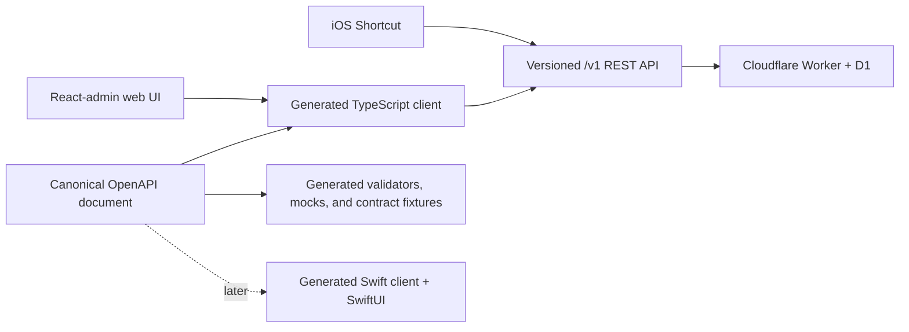

# API-first web MVP implementation plan

- Status: implemented and accepted locally
- Approved: 2026-07-15
- Governing decision: [ADR-0002](../adr/0002-api-first-web-mvp.md)
- Research: [backend](../research/api-first-backend-services.md), [service composition](../research/backend-service-compositions-community.md), and [UI](../research/cross-platform-ui-mvp.md)
- Last30Days: not needed for the post-MVP maintenance decisions — #16 is governed by measured local Vite output and #17 by Apple-owned local verification behavior; no practitioner recommendation is used as authority.
- Deployment status: local only; provider publication remains a separate approval

## Outcome

Deliver a source-controlled responsive web application that lets two participants capture and review links, maintain actor-owned preferences, edit notes and structured metadata, and query an explainable deterministic ranking. The application must work end to end against local Workers + D1, retain the existing Shortcut capture path, and be ready for a later public deployment without changing client-facing contracts.

## MVP scope

The first releasable local slice includes:

- authenticated capture creation with exact source provenance, conservative normalization, idempotent replay, and exact-link deduplication;
- ranked and filterable honeymoon-period lists with visible rank components;
- one detail surface for source history, notes, metadata, and each participant's preference;
- actor-owned vote and optional score writes that cannot overwrite the other participant;
- stable sorting and querying APIs suitable for web, Shortcut, native, CLI, and TUI clients;
- responsive loading, empty, success, validation, authorization, offline/network-error, and retry states; and
- synthetic seed/reset commands for deterministic local development and E2E tests.

The MVP does not include general registration, invitations, account recovery, multiple households, realtime subscriptions, synchronous URL enrichment, AI ranking, calendar access, push notifications, native iOS screens, paid services, or production deployment. Those are explicit later slices, not implicit placeholders.

Preference and ranking behavior begins with the reversible defaults in [requirements](requirements.md): visible actor-owned votes, optional 0–5 scores, neutral missing values, vote weights of +2/+1/−2, explicit rank boost, and visible additive components. Keep these constants inside tested domain behavior so later product refinement does not require a contract or UI rewrite.

## Contract and generation policy

1. One canonical OpenAPI document owns public `/v1` request, response, error, pagination, filtering, and sorting shapes.
2. Generate TypeScript models/client code, test mocks, contract fixtures, and routine transport plumbing. Add a Swift 6 client generator only when native work begins.
3. Generate React-admin resource/provider scaffolding from OpenAPI plus small versioned UI metadata. Product-specific React composition may be Codex- or Sites-generated and maintained as ordinary reviewed source.
4. Generated files carry a header, live in explicit generated directories, and are never hand-edited. Regeneration must be deterministic and checked in CI.
5. Handwritten source is limited to domain behavior—normalization, idempotency, authorization decisions, preference semantics, ranking—and the thinnest adapter no maintained generator can produce. Every exception is named in code review.
6. React-admin query conventions, Cloudflare bindings, D1 SQL details, Sites lifecycle, and future Supabase table APIs never enter the public contract.

## Toolchain

Use a workspace with locked dependencies and one aggregate command. Prefer native-backed tools when capability is equivalent:

- Vite 8 with Rolldown/Oxc for development, hot module replacement, and production builds;
- React 19, TypeScript strict mode, React-admin 5, and Material UI for the web surface;
- Biome for Rust-based formatting and linting, plus `tsc --noEmit` for type checking;
- Vitest and Testing Library for domain, adapter, component, and accessibility-focused tests;
- Cloudflare Wrangler/workerd and the Workers Vitest integration for Worker + D1 behavior;
- Playwright Test for committed browser E2E tests, with traces/screenshots retained only on failure;
- ChatGPT Browser/CDP for interactive localhost inspection, network/console/DOM diagnosis, responsive review, and measured performance debugging; and
- `gh skill --agent codex --scope project` for pinned repository skills.

OpenAPI generation may use a mature non-native generator when no stable native implementation supports every required target. Generator capability and reproducibility outrank implementation language; generated output remains replaceable behind the contract.

## Test contract

Testing follows red-green-refactor at each vertical slice.

### Unit and component tests

- Require 100% branch coverage for normalization, idempotency, actor authorization, preference ownership, and ranking rules.
- Require at least 90% line and branch coverage for owned non-generated application code.
- Exclude generated clients/models and declarative migrations from coverage, but validate them with regeneration and contract tests.
- Test component loading, empty, validation, error, retry, mutation, responsive, keyboard, and accessible-name behavior.

### Contract and integration tests

- Validate every request and response against OpenAPI, including a stable error envelope.
- Run migrations from zero against disposable local D1 and verify foreign keys, uniqueness, actor isolation, pagination, sorting, and deterministic seed/reset behavior.
- Retain the existing Shortcut-shaped smoke flow as a compatibility test.

### Playwright E2E tests

Commit independent tests for:

1. capture a valid link and observe it in the ranked list;
2. replay the same request without duplicating the honeymoon-period;
3. record each participant's preference and preserve ownership;
4. edit notes and structured metadata;
5. filter and sort while retaining visible rank explanations;
6. exercise empty, invalid-link, unauthorized, and network-retry states;
7. verify the primary phone viewport and keyboard-only workflow; and
8. reload with persisted server state and no client-only source of truth.

Tests use role/label locators, deterministic synthetic data, isolated workers, no arbitrary sleeps, and no `networkidle`. Browser/CDP findings become a committed regression test when reproducible.

## Tracer-bullet sequence

1. **Workspace and gates:** promote the Worker prototype into the production workspace; add TypeScript strictness, Biome, aggregate scripts, OpenAPI skeleton, deterministic generation, and CI-equivalent local checks.
2. **Capture contract:** move capture/idempotency/auth/normalization behind generated types and preserve the Shortcut compatibility smoke test.
3. **Query and ranking:** implement list/detail/filter/sort contracts and fully tested explainable ranking.
4. **Web shell:** generate the React-admin provider/resources and render seeded list/detail loading, empty, and error states.
5. **Preferences and metadata:** complete participant preference, notes, metadata, mutation, and authorization workflows from UI through D1.
6. **Full E2E and quality:** add complete Playwright flows, responsive/accessibility checks, Browser/CDP inspection, coverage gates, production build, and clean regeneration verification.
7. **Deployment readiness:** document secrets, migrations, rollback/export, rate limits, observability, and the exact human provider-login checkpoint. Do not deploy without approval.

Each tracer bullet must leave a runnable end-to-end behavior, focused tests, and the aggregate check green. Do not build all backend layers before presenting a working UI slice.

## GPT-5.6 Sol orchestration

- The GPT-5.6 Sol root owns the plan, shared contracts, integration, Git, publication, and completion judgment.
- Use at most three direct children and no recursive delegation. Give each writer an exclusive path and one unblocked tracer-bullet ticket.
- A Terra `worker` or `web-specialist` implements one vertical slice with TDD. Run Playwright/Browser ownership serially when shared ports or browser state could collide.
- After material integration, use fresh independent Terra agents: `verifier` maps acceptance criteria to evidence and returns `ACCEPT`/`REJECT`; `validator` runs reproducible checks and returns `PASS`/`FAIL`. Neither edits.
- Use the Sol `reviewer` only for material security, privacy, data-loss, concurrency, accessibility, or architecture risk. Use `ios-specialist` only after native work begins.
- On correction, rerun the affected independent pass; rerun both when shared integration or evidence changes.
- Persist through recoverable failures. Stop only for a genuine authorization boundary, conflicting product decision, or human-only ceremony, and batch the exact request after completing independent work.

## Required skills and surfaces

- `tdd`, `implement`, and `code-review` for each ticket lifecycle;
- `cloudflare` for Workers/D1 implementation with current official references;
- `react-admin` and `react-best-practices` for the web source;
- `frontend-testing-debugging` and `playwright-cli` for rendered verification and E2E generation/debugging;
- existing Build iOS Apps skills only when the native phase begins;
- Sites for optional saved visual exploration, never as API source of truth; and
- Browser Developer Mode when available, with explicit CDP approval and synthetic/local data only.

## Completion conditions

The web MVP is complete only when:

- every in-scope API and screen behavior works against a newly migrated local D1 database;
- the Shortcut compatibility flow and all unit, component, contract, integration, and Playwright tests pass;
- coverage thresholds, strict type checking, Biome, deterministic generation, and the production build pass from a clean checkout;
- responsive and keyboard workflows are verified, material Browser/CDP findings have regression coverage, and no private data or secrets appear in artifacts;
- generated code is reproducible and no public contract leaks React-admin or Cloudflare-specific conventions;
- setup, architecture, testing, deployment-readiness, and residual-risk documentation match the implementation; and
- fresh independent verifier and validator passes accept the integrated result.

Provider deployment, a public URL, production identities, and native iOS distribution are separate completion gates requiring their own authorization.

## Completed post-MVP maintenance

The local MVP is accepted and mechanically green. These low-risk follow-ups were
completed and independently accepted on 2026-07-17. Their closed issues remain
delivery evidence and should not reopen the MVP completion gate unless their
risk or scope materially changes:

- [#16 Enforce a production web bundle budget and split oversized chunks](https://github.com/ray-manaloto/honeymoon-period/issues/16)
  — measure the current bundle, introduce useful code splitting, and enforce an
  agreed production budget without changing application behavior.
- [#17 Add non-mutating validation for signed Shortcut deliverables](https://github.com/ray-manaloto/honeymoon-period/issues/17)
  — strengthen read-only artifact validation while preserving the explicit
  authorization boundary around rebuilding or re-signing deliverables.
- [#18 Reject duplicate OpenAPI `operationId` values in semantic verification](https://github.com/ray-manaloto/honeymoon-period/issues/18)
  — close the remaining semantic-audit ambiguity with a diagnostic regression.

The canonical planning board is the
[honeymoon-period GitHub Project](https://github.com/orgs/ray-manaloto/projects/1).

## Deferred product questions

These questions are intentionally deferred and did not block completed
maintenance issues #16, #17, or #18:

- [#19 Decide preference visibility, scoring, veto, missing-value, and ranking configuration](https://github.com/ray-manaloto/honeymoon-period/issues/19);
- [#20 Define calendar lifecycle, privacy, recurring offers, and deadline behavior](https://github.com/ray-manaloto/honeymoon-period/issues/20); and
- [#21 Define venue and source merging semantics before public deployment](https://github.com/ray-manaloto/honeymoon-period/issues/21).

Each remains a `question`/`needs-triage` item until its product decision is
approved. None is ready for agent implementation.

## Tracker reconciliation

GitHub issues #1, #7, and #8 are retained as closed historical evidence for the
superseded existing-product bake-off. ADR-0002 records the API-first decision;
the accepted local MVP and completed maintenance issues #16--#18 are retained
delivery evidence. Deferred questions #19--#21 are the only open tracker surface
and remain non-blocking, non-implementation-ready backlog.
